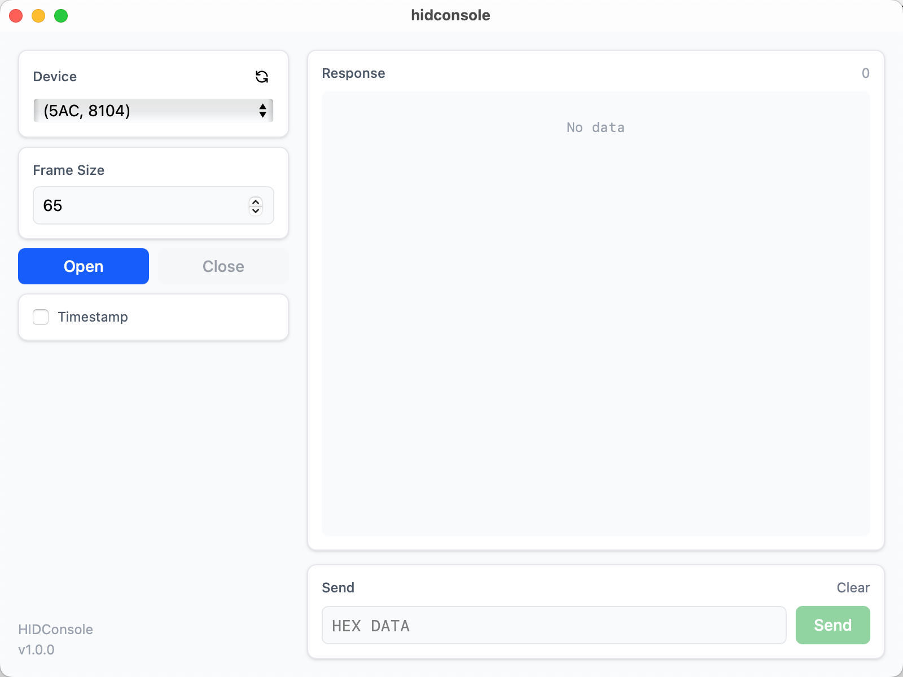

# HIDConsole

A cross-platform HID device debugger built with Tauri, React, and Rust.

[中文文档](README-CN.md)

## Features


- Scan and connect to HID devices
- Real-time data monitoring with timestamp
- Send hex data with validation
- Frame size configuration
- Auto-refresh device list
- Cross-platform support (macOS, Windows, Linux)

## Requirements

- Node.js 18+
- Rust 1.70+
- Tauri CLI

## Installation

```bash
# Install dependencies
pnpm install

# Install Tauri CLI
cargo install tauri-cli
```

## Development

```bash
# Start development server
pnpm tauri dev
```

## Build

```bash
# Build for current platform
pnpm tauri build
```

### Cross-Platform Build

You can build for other platforms using Cargo target triples:

**macOS:**
```bash
# Intel (x86_64)
pnpm tauri build --target x86_64-apple-darwin

# Apple Silicon (ARM64)
pnpm tauri build --target aarch64-apple-darwin
```

**Windows:**
```bash
# x64
pnpm tauri build --target x86_64-pc-windows-msvc

# x86
pnpm tauri build --target i686-pc-windows-msvc
```

**Linux:**
```bash
# x64
pnpm tauri build --target x86_64-unknown-linux-gnu

# arm64
pnpm tauri build --target aarch64-unknown-linux-gnu
```

> **Note:** Cross-platform builds require the corresponding Rust target to be installed:
> ```bash
> rustup target add <target-triple>
> ```

## Usage

1. Select a device from the dropdown list
2. Configure frame size (default: 65)
3. Click "Open" to connect
4. View received data in the response panel
5. Send hex data using the input field

## Tech Stack

- **Frontend**: React 19, TypeScript, TailwindCSS
- **Backend**: Rust, Tauri 2, hidapi
- **Build Tool**: Vite

## License

MIT